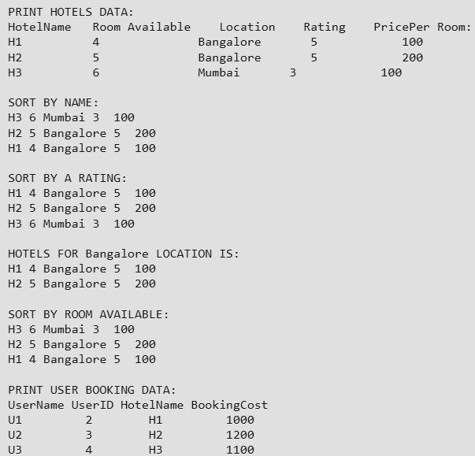

# Hotel Management System

## 📌 Overview
This is a **console-based Hotel Management System** implemented in **Python**, designed as a **machine coding round solution**.

The project demonstrates:
- Object-Oriented Programming
- Custom sorting using magic methods
- Filtering data
- Clean, modular, and extensible design

---

## 🎯 Problem Statement
Given predefined **Hotel Data** and **User Data**, perform the following operations:

1. Print hotel data
2. Sort hotels by name
3. Sort hotels by highest rating
4. Display hotels located in Bangalore
5. Sort hotels by maximum room availability
6. Print user booking details

---

## 🏨 Hotel Data

| Hotel | Rooms Available | Location  | Rating | Price |
|------|-----------------|-----------|--------|-------|
| H1   | 4               | Bangalore | 5      | 100   |
| H2   | 5               | Bangalore | 5      | 200   |
| H3   | 6               | Mumbai    | 3      | 100   |

---

## 👤 User Data

| User | User ID | Booking Cost |
|-----|--------|--------------|
| U1  | 2      | 1000         |
| U2  | 3      | 1200         |
| U3  | 4      | 1100         |

---

## 🧠 Approach

1. Created `Hotel` and `User` classes
2. Used magic method `__lt__()` for dynamic sorting
3. Implemented class-level sorting parameter
4. Used list comprehensions for filtering by city
5. Printed structured output to console
6. Designed the solution to be clean and extensible

---

## 🛠️ Technologies Used
- Python 3
- OOP Concepts
- Sorting & Filtering
- List Comprehensions

---

### Prerequisites
- Python 3.8 or later

---

## 📸 Sample Output

---

## 🎯 Use Case
- Machine Coding Round Practice.
- Python OOP Demonstration.
- Interview Preparation.
- Beginner to Intermediate Python Project.
